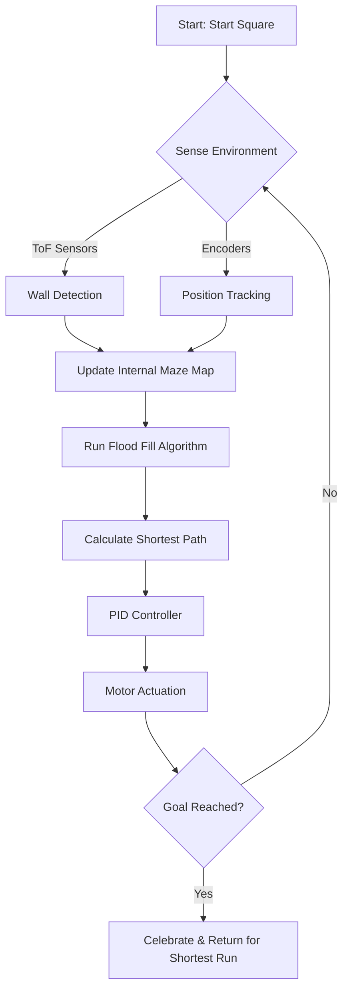
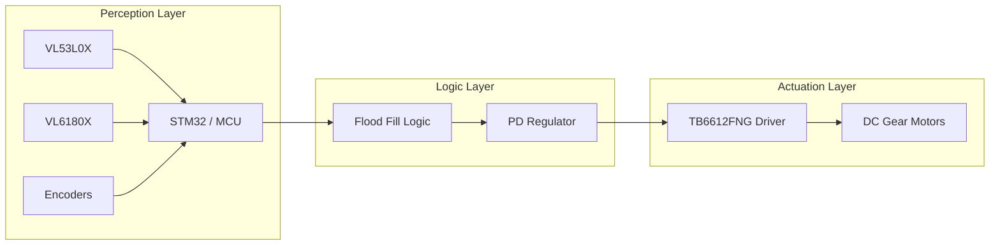

# 🤖 Autonomous Navigator: Professional Micromouse & Pathfinding AI

[](https://github.com/gowthamnow/Autonomous-Navigator-with-Algorythms)
[](https://opensource.org/licenses/MIT)
[]()
[]()

> **Autonomous Navigator** is a high-performance, precision-engineered Micromouse robot capable of solving complex 16x16 mazes. It represents the pinnacle of hardware-software integration, featuring custom multi-layer PCBs, a sophisticated **Flood Fill** algorithm, and real-time **PD control**.

---

## 📖 Table of Contents
1.  [Introduction](#introduction)
2.  [Workflow & Architecture](#workflow--architecture)
3.  [Hardware Evolution (Version 1 to 3)](#hardware-evolution)
    *   [Version 1: Single Layer (Debut)](#version-1-single-layer)
    *   [Version 2: Double Layer (Standard)](#version-2-double-layer)
    *   [Version 3: SMT (Professional Final)](#version-3-smt-professional)
4.  [Algorithm Deep Dive](#algorithm-deep-dive)
    *   [Flood Fill Implementation](#flood-fill-logic)
    *   [Path Optimization](#path-optimization)
5.  [Control Theory & PID Tuning](#control-theory)
6.  [Sensor Fusion & Perception](#sensor-fusion)
7.  [Competition Experience: Robofest](#competition-experience)
8.  [Media Gallery](#media-gallery)
9.  [Technical Specifications](#technical-specifications)
10. [Setup & Deployment](#setup--deployment)
11. [Troubleshooting Guide](#troubleshooting)
12. [Contribution & Roadmap](#contribution)
13. [License](#license)

---

## 🌟 Introduction

The **Autonomous Navigator** project is a comprehensive platform for testing control algorithms, sensor fusion, and embedded systems design. Developed with a focus on speed, reliability, and precision, this robot has been refined through multiple hardware iterations to achieve competitive parity with international Micromouse standards.

The primary goal of this repository is to document the technical journey of building a robot that can perceive its environment, make real-time decisions, and execute precise physical movements in a constrained 16x16 grid environment.

---

## 🗺️ Workflow & Architecture

The system architecture is divided into three main layers: **Perception**, **Decision**, and **Actuation**.

### System Workflow Block Diagram



### High-Level Component Interactions



---

## 🏎️ Hardware Evolution

This project underwent three significant hardware redesigns to improve reliability and performance.

### 🟢 Version 1: Single Layer (The Debut)
The **Single Layer Version** was the initial debut of the project. Designed for rapid prototyping and local fabrication, it allowed for quick testing of the core Flood Fill logic and sensor layouts.

*   **Iteration**: Version 1.0
*   **Priority**: Ease of fabrication and educational accessibility.
*   **Design Tool**: DipTrace / Manual Etching compatible.
*   **Legacy**: Established the initial sensor-to-wheel base geometry.
*   **Build Artifacts**: [SINGLE_DOUBLE_LAYER_PCB_DESIGN/SINGLE_LAYER/](SINGLE_DOUBLE_LAYER_PCB_DESIGN/SINGLE_LAYER/)

<div align="center">
  
  <p><i>The Original Version 1: Single Layer Debut</i></p>
</div>

### 🟡 Version 2: Double Layer (Standard Evolution)
The **Double Layer Version** marked a significant leap in signal integrity and power distribution. By utilizing both sides of the PCB, we were able to separate high-current motor traces from sensitive I2C sensor lines.

*   **Iteration**: Version 2.0
*   **Priority**: Reliability and standardized PCB manufacturing.
*   **Key Upgrade**: Integrated more stable power regulation and dedicated headers for all 5 ToF sensors.
*   **Visual Assets**:
    *   **Assembled Robot**: [ASSEMBLED_ROBO.HEIC](Pictures/ASSEMBLED_ROBO.HEIC)
    *   **Layout Design**: [double_layer_layout.png](Pictures/double_layer_layout.png)
*   **Build Artifacts**: [SINGLE_DOUBLE_LAYER_PCB_DESIGN/DOUBLE_LAYER/](SINGLE_DOUBLE_LAYER_PCB_DESIGN/DOUBLE_LAYER/)

<div align="center">
  <table style="border-collapse: collapse; border: none;">
    <tr>
      <td align="center"><br><b>V2 Double Layer Layout</b></td>
      <td align="center"><br><b>V2 Assembled Bot</b></td>
    </tr>
  </table>
</div>

### 🔵 Version 3: SMT (Professional Final Version)
The **SMT Version** is the current flagship and the pinnacle of the project's development. It uses Surface Mount Technology to minimize weight and footprint, allowing the bot to accelerate faster and make tighter turns with extreme precision.

*   **Iteration**: Version 3.0 (Current)
*   **Priority**: Performance, compactness, and high-speed stability.
*   **Main Microcontroller**: STM32 Onboard (Custom Embedded).
*   **Visual Assets**:
    *   **Top View**: [Bot_view1.jpeg](Pictures/Bot_view1.jpeg)
    *   **Fabricated Board**: [fab_Board.jpeg](Pictures/fab_Board.jpeg)
*   **Build Artifacts**: [PCB_SMD_DESIGN_FILES/](PCB_SMD_DESIGN_FILES/)

<div align="center">
  <table style="border-collapse: collapse; border: none;">
    <tr>
      <td align="center"><br><b>V3 Professional SMT PCB</b></td>
      <td align="center"><br><b>V3 Final Robot</b></td>
    </tr>
  </table>
</div>

---

## 🧠 Algorithm Deep Dive

### Flood Fill Implementation
The robot solves the maze by mapping a "potential flow" from any cell to the center. The maze is represented as a 16x16 coordinate system.

```cpp
// Static default flood map for 16x16 grid
byte flood[16][16]=
       {{14,13,12,11,10,9,8,7,7,8,9,10,11,12,13,14},
        {13,12,11,10,9,8,7,6,6,7,8,9,10,11,12,13},
        {12,11,10,9,8,7,6,5,5,6,7,8,9,10,11,12},
        {11,10,9,8,7,6,5,4,4,5,6,7,8,9,10,11},
        {10,9,8,7,6,5,4,3,3,4,5,6,7,8,9,10},
        {9,8,7,6,5,4,3,2,2,3,4,5,6,7,8,9},
        {8,7,6,5,4,3,2,1,1,2,3,4,5,6,7,8},
        {7,6,5,4,3,2,1,0,0,1,2,3,4,5,6,7},
        {7,6,5,4,3,2,1,0,0,1,2,3,4,5,6,7},
        {8,7,6,5,4,3,2,1,1,2,3,4,5,6,7,8},
        {9,8,7,6,5,4,3,2,2,3,4,5,6,7,8,9},
        {10,9,8,7,6,5,4,3,3,4,5,6,7,8,9,10},
        {11,10,9,8,7,6,5,4,4,5,6,7,8,9,10,11},
        {12,11,10,9,8,7,6,5,5,6,7,8,9,10,11,12},
        {13,12,11,10,9,8,7,6,6,7,8,9,10,11,12,13},
        {14,13,12,11,10,9,8,7,7,8,9,10,11,12,13,14}};
```

#### Recalculation Logic (`floodFill3`)
When a wall is detected, the robot runs a Breadth-First Search (BFS) inspired re-seeding algorithm to update all cell weights.

```cpp
void floodFill3(){
    while (!queue.isEmpty ()){
        yrun=queue.dequeue();
        xrun=queue.dequeue();
        x_0,y_0,x_1,y_1,x_2,y_2,x_3,y_3 = getSurrounds(xrun,yrun);
        if(x_0>=0 && y_0>=0 ){
            if (flood[y_0][x_0]==254){
                if (isAccessible(xrun,yrun,x_0,y_0)){
                    flood[y_0][x_0]=flood[yrun][xrun]+1;
                    queue.enqueue(y_0);
                    queue.enqueue(x_0);
}}}}
```

---

## ⚙️ Control Theory: PD Regulation

To maintain a straight path between walls, we use a Proportional-Derivative (PD) controller.

*   **Error Calculation**: $Error = Distance_{Left} - Distance_{Right}$
*   **Tuning Values**: $Kp = 0.2, Kd = 1.6$

```cpp
void wallPid() {
    wallError = (tof[0] - (tof[4]));
    correction = (wallError * wallP) + ((wallError - wallLastError) * wallD);
    wallLastError = wallError;
    leftPwm = leftBase - correction;
    rightPwm = rightBase + correction;
}
```

---

## 📺 Project in Action

<div align="center">
  <video src="Event_Working_Video/Ultrasonic%202%20Winner%20maze%20solving%20in%20shortest%20time.mp4" width="700" controls></video>
  <p>🥇 <b>Robofest Winning Run: Solving the shortest path in record time.</b></p>
</div>

---

## 📂 Repository Roadmap & Structure

```text
├── CODE/                   # Firmware with algorithms and PID control
│   ├── Algo.ino            # Main Flood Fill and pathfinding logic
│   ├── PID.ino             # PD controller implementation
│   └── Sensor.ino          # I2C ToF sensor abstraction
├── PCB_SMD_DESIGN_FILES/    # Production-ready Altium files (SMT Version)
├── SINGLE_DOUBLE_LAYER_PCB_DESIGN/ # Legacy design files (V1 & V2)
├── Robofest/               # Competition documentation and certificates
├── Event_Working_Video/      # Demonstration and competition footage
└── Winning_Photos/         # Archive of awards and winner photos
```

---

## 📊 Detailed Technical Specifications

### Actuation System
*   **Motors**: 1000 RPM Micro Metal Gear Motors with quad-magnetic encoders.
*   **Driver**: TB6612FNG Dual H-Bridge, capable of 1.2A continuous current per channel.
*   **Control**: Independent 10-bit PWM for left and right wheels.

### Perception System
*   **Central Sensor**: VL53L0X (Long range, up to 2m, front detection).
*   **Lateral Sensors**: VL6180X (Short range, high precision, side detection).
*   **Feedback**: Magnetic encoders with 12 Counts Per Revolution (CPR) before gear reduction.

---

## 🚀 Setup & Execution Guide

1.  **Hardware Selection**: Choose Version 3 (SMT) for competition or Volume 1 (Single) for prototyping.
2.  **Environment Setup**: Install Arduino IDE and the STM32 Board Core.
3.  **Firmware Deployment**: Upload `CODE/Algo.ino` to the MCU.
4.  **Tuning**: Monitor results through the Serial Monitor and adjust PID constants in `PID.ino`.

---

## 📄 License
Licensed under the **MIT License**. Created for education and competition.

---
*Autonomous Navigator - Designed by Gowtham.*
