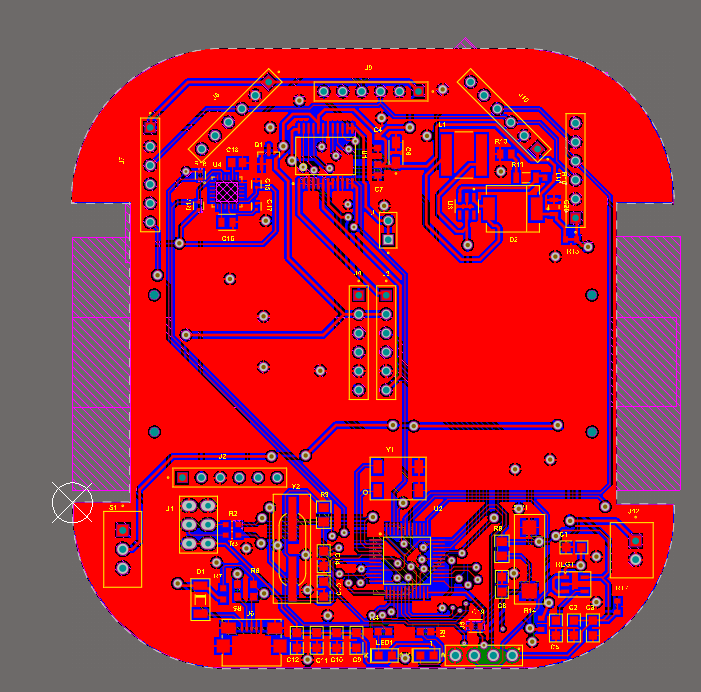

# Autonomous Navigator with Algorithms

Autonomous Navigator is a high-performance micromouse robot designed for maze solving and autonomous navigation. This repository contains the complete firmware, PCB design files, and visuals of the project.

## 📸 Project Visuals

<table align="center">
  <tr>
    <td align="center"><b>Fabricated Board</b> </td>
    <td align="center"><b>Bot View</b> </td>
  </tr>
  <tr>
    <td align="center"><b>Bot View - Alternate</b> </td>
    <td align="center"><b>PCB Layout</b> </td>
  </tr>
  <tr>
    <td align="center" colspan="2"><b>3D Design</b> </td>
  </tr>
</table>

---

## 📂 Project Structure

### 💻 [CODE](CODE/)
The firmware is written in C++/Arduino and handles sensor processing, motor control, and maze-solving algorithms.
- **[Algo.ino](CODE/Algo.ino)**: Core maze-solving logic and algorithms.
- **[PID.ino](CODE/PID.ino)**: Proportional-Integral-Derivative control for stable navigation.
- **[Sensor.ino](CODE/Sensor.ino)**: Data acquisition from distance and orientation sensors.
- **[Motor.ino](CODE/Motor.ino)**: Low-level motor driver logic.
- **[Turns.ino](CODE/Turns.ino)**: Precise turning mechanism logic.
- **[Wallfollow.ino](CODE/Wallfollow.ino)**: Basic navigation logic for wall following.

### 🛠️ [PCB DESIGN FILES](PCB_DESIGN_FILES/)
Complete hardware design files created using Altium Designer.
- **STM32 ONBOARD.PcbDoc**: Professional PCB layout for the STM32-based controller.
- **Sheet1.SchDoc**: Detailed schematic diagrams of the electrical system.
- **FinalSMT.PrjPcb**: Altium project file.
- **CAM Files**: Standard fabrication files for manufacturing.

---

## 🚀 Getting Started

1. **Hardware**: Use the files in `PCB_DESIGN_FILES` to fabricate the custom PCB.
2. **Firmware**: Upload the `CODE` directory files to your microcontroller using the Arduino IDE or a compatible platform.
3. **Configuration**: Adjust PID parameters in `PID.ino` based on your specific motor and weight configuration.

## 🤝 Contributing
Feel free to fork this repository, submit issues, or create pull requests to improve the navigation algorithms or hardware design.

---
*Developed by [Gowtham](https://github.com/gowthamnow)*
