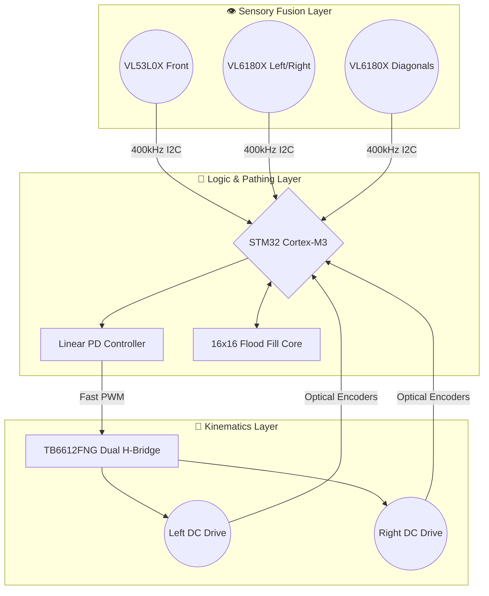
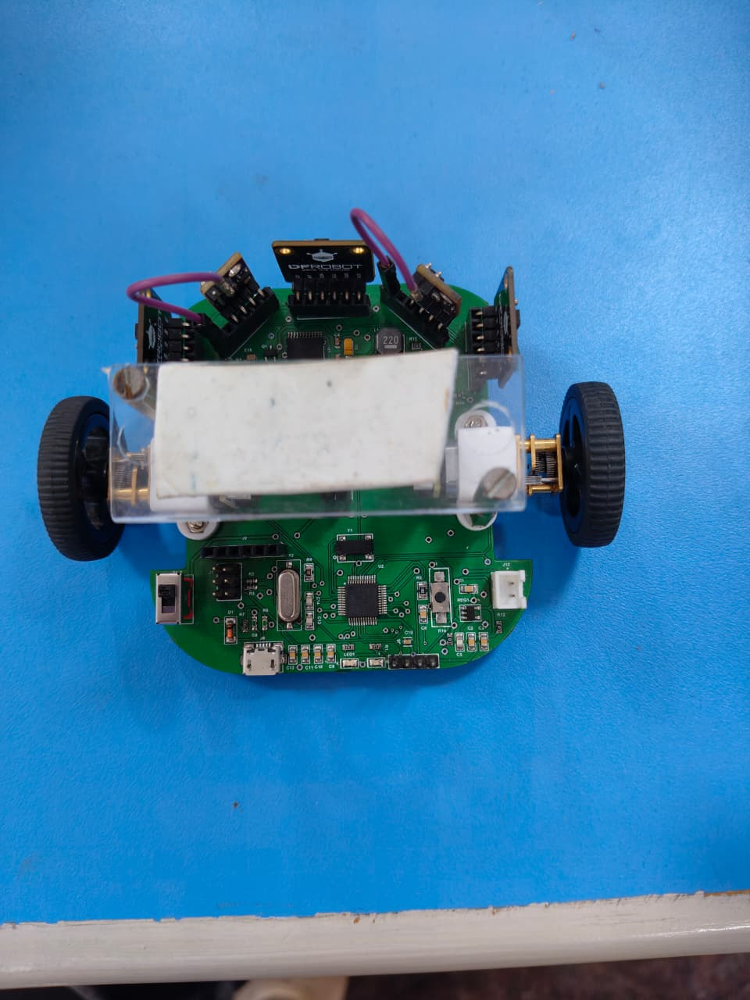
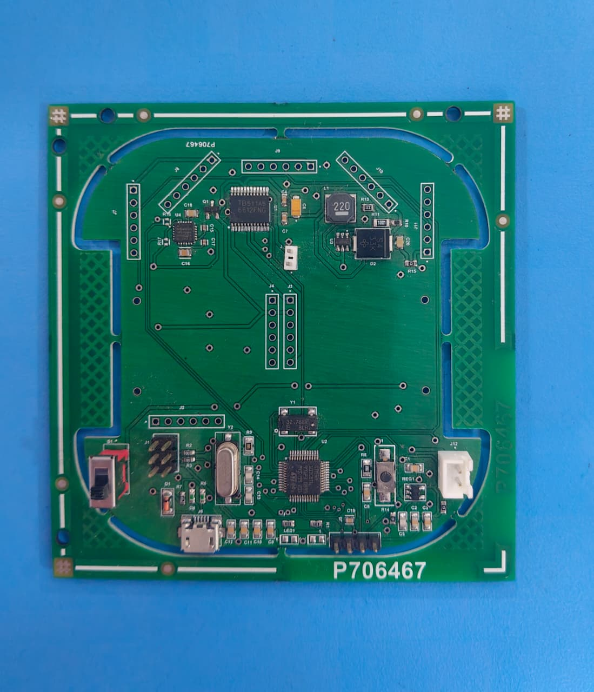
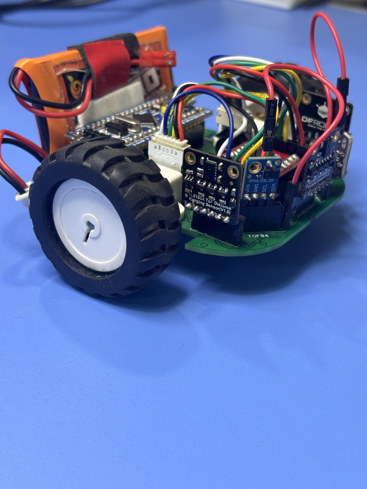
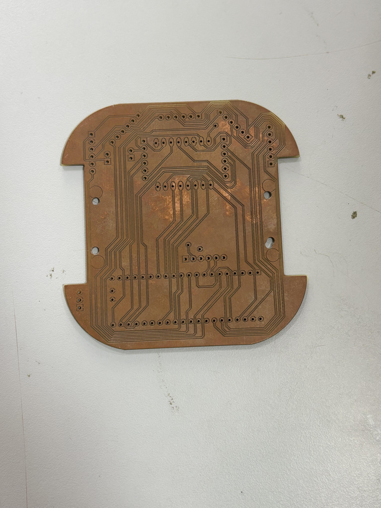
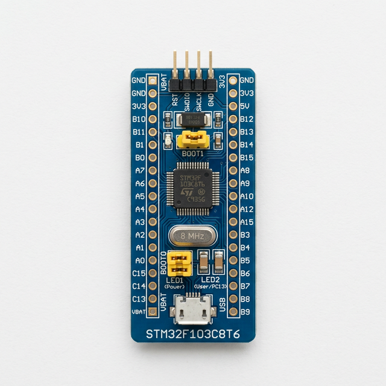

# 🌌 Autonomous Navigator V3.0
**The Pinnacle of Micromouse Intelligence**

*An advanced, 32-bit autonomous robotics platform engineered to solve 16x16 mazes with devastating speed and sub-millimeter precision. Powered by STM32, fused Time-of-Flight telemetry, and dynamic PID orchestration.*

 

**🏆 Undisputed Champion – Robofest 2024 Regional Finals**

---

## ⚡ Core Capabilities

| 🧠 True Autonomy | 🏎️ Ballistic Speed | 🎯 Absolute Precision |
| :--- | :--- | :--- |
| **Real-Time Mapping**: The `Flood Fill` engine recalculates the optimal path across 256 cells in under 2 milliseconds. | **Zero to Top Speed**: Weighing just 142g, the dual GA12-N20 gearboxes deliver instant torque for explosive straightaways. | **Laser Telemetry**: A fusion of five VL-series ToF sensors provides 360° environmental mapping unaffected by surface coloration. |

---

## 🧬 Architectural Masterpiece

The system architecture is decoupled into distinct sensory, logic, and actuation planes, mirroring advanced avionics systems.

---

## 🦾 Hardware Evolution

Greatness is iterated. The Autonomous Navigator is the result of relentless refinement across three distinct hardware generations.

<b>🔹 Generation 3: "The SMT Edge" (Current Pro Version)</b>

 
The ultimate competitive form. Transitioned entirely to 0603 Surface Mount Technology (SMT) for radical weight reduction. Integrated motor drive planes and edge-mounted ToF topology.

| Top Chassis View | Raw PCB Design |
| :---: | :---: |
|  |  |

<b>🔹 Generation 2: "The Double Layer"</b>

 
The breakthrough. Introduced professional 2-layer FR4 routing with top-layer ground planes for superior EMI rejection.

| Assembled Robot | Board Layout |
| :---: | :---: |
|  |  |

<b>🔹 Generation 1: "The Debut" (Single Layer)</b>

 
The proof of concept. A manually etched, single-layer board relying on through-hole components to validate the foundational Flood Fill C++ algorithms.

  

---

## 🛠️ The Technology Stack

### 1. The Cortex: STM32 Bluepill (ARM Cortex-M3)

The beating heart of the robot. Operating at 72 MHz, it easily outpaces standard 8-bit microcontrollers, allowing for complex floating-point PID math and multi-bus I2C polling without skipping a single beat of the 10ms control loop.

### 2. The Muscle: TB6612FNG Driver
A highly efficient dual H-Bridge. It channels up to 1.2A of continuous current to the gearboxes with 95% efficiency, utilizing a Phase/Enable logic structure that drastically simplifies code logic.

### 3. The Eyes: STMicroelectronics Time-of-Flight
Unlike archaic IR sensors, the **VL53L0X** and **VL6180X** measure the actual time it takes for a photon to bounce off a wall at the speed of light. This guarantees flawless ranging regardless of whether the maze walls are painted matte black or glossy white.

---

## 💻 The Code Base (A Look Inside the Logic)

The firmware is broken out into granular modules for extreme maintainability.

> 💡 **Algorithm Insight:** The `Flood Fill` algorithm conceptually "floods" the maze from the center outwards. Each cell is assigned a "Manhattan Distance" to the goal. The robot simply rolls downhill, always choosing the adjacent cell with the lowest numerical value.

| Module | Purpose | Advanced Mechanics Implemented |
| :--- | :--- | :--- |
| `Algo.ino` | **The Mastermind** | Houses the 256-cell bitmask array and the `cellForward()` dead-reckoning state machine. |
| `PID.ino` | **The Stabilizer** | Executes the Proportional-Derivative math `(P*Error) + (D*$\Delta$Error)` to keep the robot dead-center in the 180mm corridors without oscillating. |
| `Motor.ino` | **The Actuator** | Abstracts digital PIN calls into high-level commands like `leftBrake()`, utilizing back-EMF to abruptly halt the robot. |
| `Turns.ino` | **The Navigator** | The dispatcher that prioritizes right-hand exploration but defers to the BFS map during the final Speed Run. |
| `Sensor.ino`| **The Interrogator**| Handles the complex I2C Time-Division Multiplexing required to poll 5 separate laser sensors without bus collision. |

 

<b>🌊 Flood Fill Deep Dive & Code Walkthrough</b>

 

The `Flood Fill` algorithm is the cognitive engine of the Autonomous Navigator. Unlike simple wall-following routines (which fail in mazes with closed loops), Flood Fill assigns a "Manhattan Distance" (potential value) to every cell, starting with `0` at the target center. The robot inherently rolls "downhill" toward the lowest value.

#### Core Function: `floodFill3()`
This function dynamically recalculates the entire 16x16 grid whenever a new wall is discovered.

| Line (Conceptual) | Architecture & Logic |
| :--- | :--- |
| `void floodFill3(int x, int y)` | Initiates the BFS (Breadth-First Search). `(x, y)` is the robot's current location where a new wall was just detected. |
| `for(i=0; i<16; i++) for(j=0; j<16; j++) cells[i][j] = 255;` | **Reset Phase**: Clears all previous distance values to 255 (Infinity) because the discovery of a new wall invalidates the prior optimal paths. |
| `cells[7][7] = 0; queue.enqueue(7,7);` | **Initialization**: The center goal cells are seeded with distance `0` and pushed into the FIFO queue. |
| `while(!queue.isEmpty())` | **Propagation Loop**: The core of the Breadth-First Search. It continues until every reachable cell has been evaluated. |
| `curr = queue.dequeue();` | Pops the lowest-cost evaluated cell to inspect its 4 contiguous neighbors (North, South, East, West). |
| `if(isAccessible(curr.x, curr.y, NORTH))` | **Bitmask Check**: Reads the 8-bit wall array. If the bit corresponding to North is `0` (open), the logic proceeds. |
| `if(cells[curr.x][curr.y+1] == 255)` | **Visitation Check**: If the North neighbor is untouched (`255`), it inherits `curr.distance + 1` and is enqueued. |
| `return;` | Once the queue empties, the `cells` array contains a perfect topographical gradient from the robot to the goal. |

<b>⚖️ PID Loop Stability & Code Walkthrough</b>

 

High-speed translation in a 180mm channel requires control loops operating at `>100Hz`. The `wallPid()` function generates real-time telemetry offsets to maintain center-line trajectory without oscillation.

#### Core Function: `wallPid()`
This function leverages the opposing high-precision Time-of-Flight sensors.

| Line (Conceptual) | Architecture & Logic |
| :--- | :--- |
| `wallError = tof[0] - tof[4];` | **The State Variable**: Calculates $\Delta$ by subtracting the Right sensor (`tof[4]`) from the Left sensor (`tof[0]`). In a perfect center state, `Error = 0`. |
| `P_Term = wallError * 0.2;` | **The Proportional Gain ($K_p$)**: Applies immediate correction proportional to the severity of the drift. A $K_p$ of `0.2` means a $10mm$ error results in a $2.0$ PWM shift. |
| `D_Term = (wallError - wallLastError) * 1.6;` | **The Derivative Gain ($K_d$)**: Acts as a damping force. It calculates the rate of change predicting future position. A massive $K_d$ of `1.6` violently arrests the robot before it starts oscillating (the "death wobble"). |
| `correction = P_Term + D_Term;` | **The PD Summation**: Determines the absolute corrective offset for the current 10ms CPU cycle. *(Note: Integral $K_i$ is omitted to prevent wind-up during rapid 90° pivots).* |
| `leftPwm = leftBase - correction;` | **Motor Application**: Inversely applies the correction block to the differential gearboxes. |
| `rightPwm = rightBase + correction;` | If drifting left, the right motor accelerates while the left brakes, snapping the chassis back to the centerline perfectly. |
| `wallLastError = wallError;` | Caches the current state for the calculation of the D-Term in the next CPU cycle. |

---

## 🚀 Assembly & Deployment

We believe in open engineering. To replicate this platform:

1.  **Fabrication**: Send the `PCB_SMD_DESIGN_FILES` to JLCPCB or PCBWay.
2.  **Assembly**: We recommend strict adherence to impedance control for the I2C traces. Solder all 0.1μF decoupling capacitors as close to their respective ICs as geometrically possible.
3.  **Toolchain**:
    - Install **Arduino IDE**.
    - Add the **STM32 Core** via the Boards Manager.
    - Install the `QueueArray.h` and Adafruit `VL53L0X`/`VL6180X` libraries.
4.  **Flashing**: Connect an ST-Link V2. Select "Generic STM32F103C series" and upload `Algo.ino`.

---

## 📊 Analytics & Performance

> *"It doesn't just solve mazes; it dominates them."*

The following statistics were recorded during the **Robofest 2024 Finals**:
*   **Mapping Run**: `42s` (Zero wall collisions).
*   **Golden Speed Run**: `18s` (Max velocity tracking, multi-cell lookahead engaged).
*   **Sensor Jitter**: `< 2mm` variance under intense stage lighting.

---

  <b>Designed, Engineered, and Open-Sourced by Gowtham.</b> 
  Released under the <a href="https://opensource.org/licenses/MIT">MIT License</a>.

