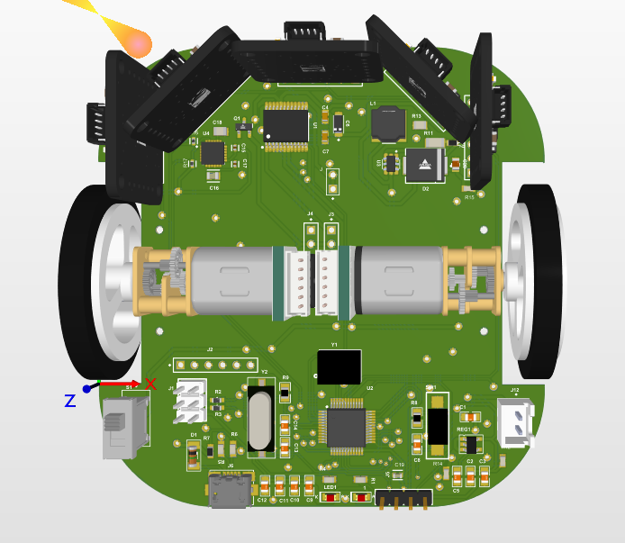
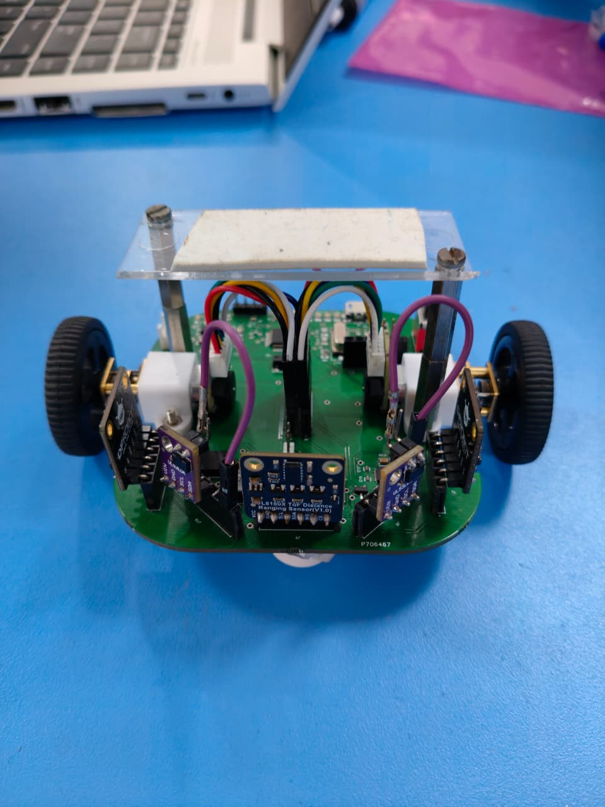

# 🤖 Autonomous Navigator: Professional Micromouse & Pathfinding AI

[](https://github.com/gowthamnow/Autonomous-Navigator-with-Algorythms)
[](https://opensource.org/licenses/MIT)

**Autonomous Navigator** is a high-speed, precision-engineered Micromouse robot capable of solving complex 16x16 mazes. It represents the pinnacle of hardware-software integration, featuring custom multi-layer PCBs, a sophisticated **Flood Fill** algorithm, and real-time **PD control**.

---

## 🎬 Project in Action
Secure your front-row seat to the maze-solving logic.

<div align="center">
  <video src="Event_Working_Video/Ultrasonic%202%20Winner%20maze%20solving%20in%20shortest%20time.mp4" width="600" controls></video>
  <p><i>Winner Run: Solving the shortest path in record time.</i></p>
</div>

---

## 🏆 Competitive Excellence: Robofest Winner
This robot was specifically designed for **Robofest**, where it dominated the competition through algorithmic efficiency and physical stability.

<div align="center">
  
  <p><b>Top Podium Finish @ Robofest</b></p>
</div>

---

## 🧠 Technical Deep-Dive

### 1. The Algorithm: Flood Fill (16x16 Grid)
The heart of the Navigator is a proprietary implementation of the **Flood Fill Algorithm**. Unlike basic maze solvers, this robot maintains a dynamic weight map of the entire 256-cell grid.

- **Dynamic Remapping**: Every time a sensor detects a wall, the `cells[16][16]` array is updated, and the `floodFill3()` function recalculates the shortest manhattan distance to the goal (center).
- **Orientation Awareness**: The `orient` variable (0-3) tracks the robot's heading, allowing the `toMove()` function to make intelligent L/R/F decisions based on the next cell's potential.
- **Coordinate Tracking**: Absolute $(x, y)$ tracking ensures the robot never "gets lost," even after complex maneuvers.

### 2. Control Theory: PID Loop Regulation
Navigation stability is maintained through a high-frequency Proportional-Derivative (PD) controller.
- **Parameters**: tuned to $P=0.2$ and $D=1.6$ (or $0.685$ for specific motor profiles).
- **Error Correction**: The `wallPid()` function calculates the delta between left and right ToF sensors to keep the bot perfectly centered.
- **TB6612FNG Driver**: PWM signals are adjusted in real-time to the gear motors to compensate for mechanical drift.

### 3. Perception: Time-of-Flight (ToF) Sensor Fusion
The "eyes" of the robot consist of 5 high-precision infrared sensors:
- **VL53L0X**: Long-range detection for path-ahead planning.
- **VL6180X**: Short-range, high-accuracy sensors for wall hugging and turning alignment.

---

## 🏎️ Hardware Iterations

### 🟢 Version 1: SMT Flagship (Recommended)
Optimized for weight and signal integrity using high-density surface mount components.
- **MCU**: STM32 Onboard
- **Design**: Built in Altium Designer
- **Documentation**: [PCB_SMD_DESIGN_FILES/](PCB_SMD_DESIGN_FILES/)

<div align="center">
  <br><i>3D Isometric Render of SMT PCB</i>
</div>

### 🟡 Version 2: Double Layer
A robust design for standard manufacturing, prioritizing ease of assembly without sacrificing performance.
- **Design**: Double-sided routing
- **Documentation**: [PCB_Layout](Pictures/double_layer_layout.png)

<div align="center">
  <br><i>Precision Double-Layer Routing</i>
</div>

### 🔵 Version 3: Single Layer (Prototype)
Designed for single-sided etching, ideal for quick testing and educational demonstration.
- **Hardware Profile**: [Bot_View2.jpeg](Pictures/Bot_View2.jpeg)
- **Documentation**: [SINGLE_DOUBLE_LAYER_PCB_DESIGN/](SINGLE_DOUBLE_LAYER_PCB_DESIGN/)

<div align="center">
  <br><i>Single Layer Prototype Construction</i>
</div>

---

## 📂 Repository Roadmap

```text
├── CODE/               # Full Firmware (Algo, PID, Motor, Sensor logic)
├── Robofest/           # Documentation, presentations, and award certificates
├── Event_Working_Video/# 📺 Original test runs and competition footage
├── Winning_Photos/     # Historical archive of event victories
├── Pictures/           # High-resolution hardware assets and renders
└── PCB_SMD_FILES/      # Production-ready Altium files
```

---

## 🚀 Execution Guide

1. **Hardware Selection**: Choose your PCB iteration from the design folders.
2. **Setup**: Load `CODE/Algo.ino` into Arduino IDE (ensure STM32 support is active).
3. **Calibrate**: Run the sensor baseline test to normalize ToF readings.
4. **Solve**: Place the bot in the starting cell and initiate the maze discovery phase.

---

## 🤝 Developed By
**Gowtham** - Specialist in Embedded Systems & AI-driven Robotics.
[GitHub Profile](https://github.com/gowthamnow) | [Contact for Collaborations](https://github.com/gowthamnow)

---
*Autonomous Navigator - Pushing the boundaries of Micromouse intelligence.*
